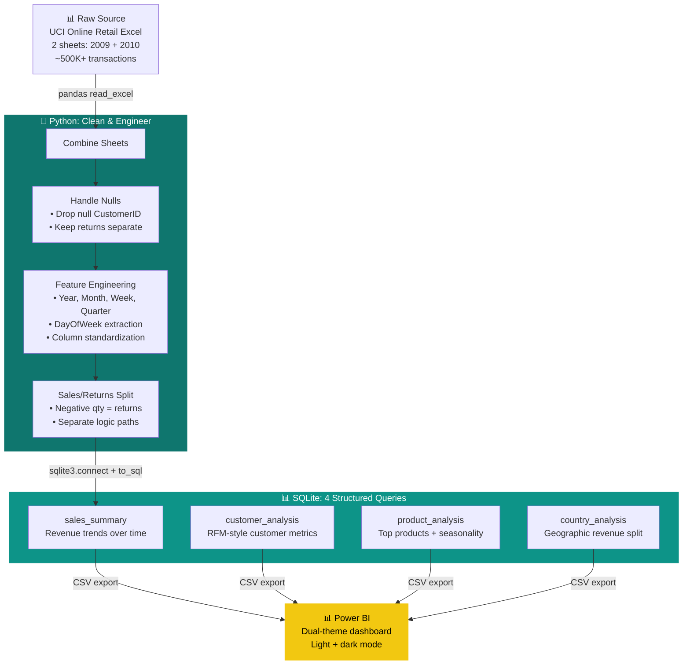

<div align="center">


<br/>

[](https://github.com/yashxsainix)

<br/>

[](https://python.org)
[](https://sqlite.org)
[](https://powerbi.microsoft.com)
[](https://microsoft.com/excel)
[](https://archive.ics.uci.edu/ml/datasets/Online+Retail)

<br/>


</div>

---

## 🛒 The Dataset

The UCI Online Retail dataset covers two years of transactions from a UK-based online retailer (2009–2011). It contains invoice records, product descriptions, quantities, unit prices, customer IDs, and country information across two separate Excel sheets — one per year.

It is a genuinely messy dataset:
- Null customer IDs that cannot be attributed
- Negative quantities representing returns
- Duplicate invoice records
- Two sheets that must be combined before any analysis is possible

Every cleaning decision in this pipeline is documented because it affects every downstream number.

---

## 🏗️ Pipeline Architecture



---

## 🔧 Cleaning Decisions That Matter

Every data project has cleaning decisions that the analyst makes. The wrong ones produce wrong dashboards. This project documents them explicitly.

<details>
<summary><b>❌ Why null CustomerIDs are dropped (not imputed)</b></summary>

Rows with null `CustomerID` cannot be attributed to any customer. That makes them useless for customer-level analysis, RFM modeling, and retention calculations — which is most of what this dashboard does. They are not imputed because there is no reliable basis for attribution.

If volume analysis is the only goal, they could be retained. They are not here.

</details>

<details>
<summary><b>📦 Why returns are separated, not dropped</b></summary>

Negative quantities represent returns or cancellations. Dropping them would overstate revenue. Mixing them with sales would understate it in the wrong places (e.g., a customer's total spend would look lower than their actual purchases).

The pipeline keeps them in a separate table and reports returns as a separate metric in the dashboard.

</details>

<details>
<summary><b>📅 Why date features are extracted in Python not Power Query</b></summary>

Extracting year, month, quarter, week, and day of week in Python before loading to SQLite means those fields are version-controlled, testable, and auditable — not buried in Power Query steps that are hard to review. Anyone reading the Python code can see exactly what time logic was applied.

</details>

---

## 🔍 The Four SQL Queries

```sql
-- 1. Sales summary — revenue trends over time
SELECT year, month, quarter,
       COUNT(DISTINCT invoice_no) as invoices,
       ROUND(SUM(quantity * unit_price), 2) as revenue
FROM sales
GROUP BY year, month, quarter
ORDER BY year, month;

-- 2. Top products by revenue
SELECT description,
       SUM(quantity) as total_units_sold,
       ROUND(SUM(quantity * unit_price), 2) as total_revenue
FROM sales
GROUP BY description
ORDER BY total_revenue DESC
LIMIT 20;

-- 3. Customer value analysis
SELECT customer_id,
       COUNT(DISTINCT invoice_no) as purchase_count,
       ROUND(SUM(quantity * unit_price), 2) as total_spend,
       MAX(invoice_date) as last_purchase
FROM sales
GROUP BY customer_id
ORDER BY total_spend DESC;

-- 4. Geographic revenue split
SELECT country,
       COUNT(DISTINCT customer_id) as customers,
       ROUND(SUM(quantity * unit_price), 2) as revenue
FROM sales
GROUP BY country
ORDER BY revenue DESC;
```

---

## 🚀 How to Run

```bash
git clone [repository-url]
pip install pandas openpyxl

# Step 1: Clean and engineer features
python etl_cleaning_sql_load.py

# Step 2: Run SQL analysis and export to CSV
python sql_analysis_export.py

# Step 3: Open Power BI and connect to the CSV outputs
# The dashboard includes both light and dark theme layouts
```

---

## 👤 Author

**Yashpal Saini** · [LinkedIn](https://linkedin.com/in/yash-saini-analyst) · [Portfolio](https://yashxsainix.github.io)


